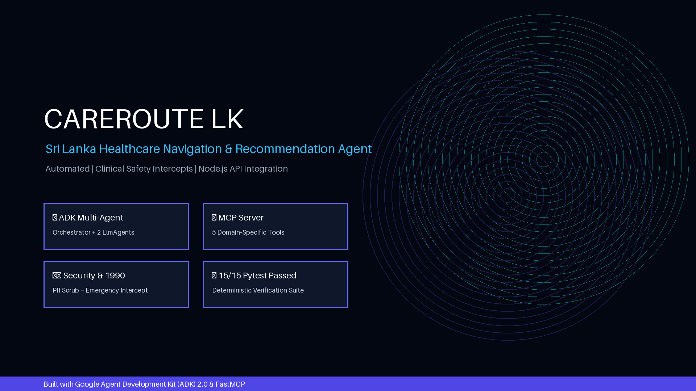
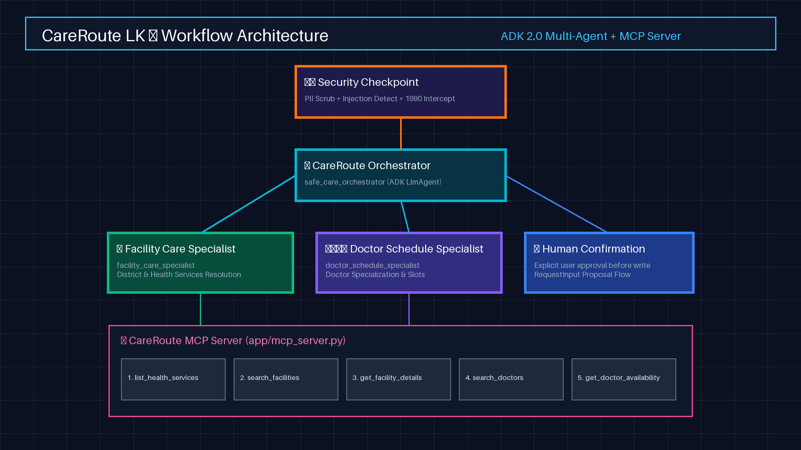
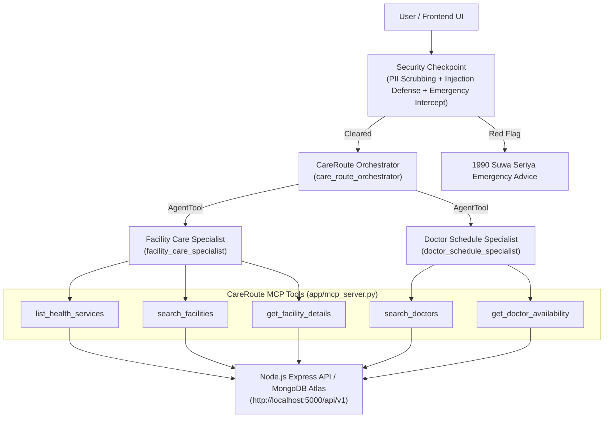

# CareRoute LK Agent Service

> AI-powered healthcare care-navigation assistant for Sri Lanka, safely matching patients with facilities, health services, doctors, and schedule availability via Node.js backend integration.

## Prerequisites
- **Python**: 3.11 – 3.13
- **uv**: Python package runner (`pip install uv` or `uvx`)
- **Gemini API Key**: Get key from [Google AI Studio](https://aistudio.google.com/apikey)

## Quick Start

```bash
# 1. Clone the repository
git clone https://github.com/<your-username>/careroute-lk-agent.git
cd careroute-lk-agent

# 2. Setup environment variables
cp .env.example .env
# Edit .env and set your GOOGLE_API_KEY=<your_key>

# 3. Install dependencies
make install

# 4. Launch the ADK Interactive Playground UI
make playground
# Access UI at http://localhost:18081
```

## Assets





## Demo Script

Refer to [DEMO_SCRIPT.txt](DEMO_SCRIPT.txt) for the complete 3-4 minute spoken narration script with visual stage cues.

## Architecture



## How to Run

- **Interactive Playground UI**:
  ```bash
  make playground
  ```
  *Opens ADK UI at [http://localhost:18081](http://localhost:18081).*

- **FastAPI Backend Server Mode**:
  ```bash
  make run
  ```
  *Serves `GET /health`, `POST /ai/recommend`, and `POST /ai/chat` on `http://localhost:8000`.*

- **Automated Pytest Suite**:
  ```bash
  make test
  ```
  *Runs 15 deterministic unit and safety tests.*

## Sample Test Cases

### Case 1: Care Navigation & Facility Search
- **Input**: `"I need dental care facilities for toothache in Colombo."`
- **Expected**: `care_route_orchestrator` routes request to `facility_care_specialist`, which invokes `search_facilities(district='Colombo', service_id='srv_dental')`.
- **Check**: Playground UI shows **Asiri Central Hospital Colombo** & **Nawaloka Hospital Colombo** with match scores and transparent reasons.

### Case 2: Doctor Schedule & Booking Proposal
- **Input**: `"Find available doctors for Cardiology in Colombo on 2026-09-05"`
- **Expected**: Routes to `doctor_schedule_specialist`, queries `search_doctors` and `get_doctor_availability`.
- **Check**: Displays **Dr. Ruwan Perera** with slots `['09:00', '10:30', '14:00']` and prepares a booking action proposal requiring user confirmation.

### Case 3: Emergency Red Flag Intercept
- **Input**: `"My friend has severe chest pain and cannot breathe"`
- **Expected**: `security_checkpoint` detects emergency red-flag, short-circuits routing, and returns emergency guidance.
- **Check**: Immediately alerts user to call **1990 Suwa Seriya** emergency ambulance service without clinical diagnosis.

## Troubleshooting

1. **`429 RESOURCE_EXHAUSTED` / Rate Limit**:
   - Ensure `GEMINI_MODEL=gemini-2.5-flash` in `.env`. For higher free-tier quotas, switch to `gemini-2.5-flash-lite`.

2. **Backend Unreachable (`ECONNREFUSED` / Timeout)**:
   - The agent service automatically uses fallback mock data when Node API (`http://localhost:5000/api/v1`) is offline. Ensure Node server is running for live DB queries.

3. **Windows Code Changes Not Reflecting**:
   - Hot-reload is disabled on Windows for sub-processes. Stop the running process (`Ctrl+C` or PowerShell `Stop-Process`) and relaunch `make playground`.

## Push to GitHub

1. Create a new repo at https://github.com/new
   - Name: `careroute-lk-agent`
   - Visibility: Public or Private
   - Do NOT initialize with README (you already have one)

2. In your terminal, navigate into your project folder:
   ```bash
   cd careroute-lk-agent
   git init
   git add .
   git commit -m "Initial commit: careroute-lk-agent ADK agent"
   git branch -M main
   git remote add origin https://github.com/<your-username>/careroute-lk-agent.git
   git push -u origin main
   ```

3. Verify `.gitignore` includes:
   ```gitignore
   .env          ← your API key — must NEVER be pushed
   .venv/
   __pycache__/
   *.pyc
   .adk/
   ```

⚠️ **NEVER push `.env` to GitHub. Your API key will be exposed publicly.**
